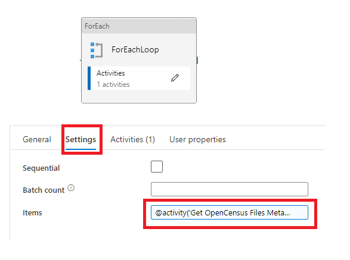
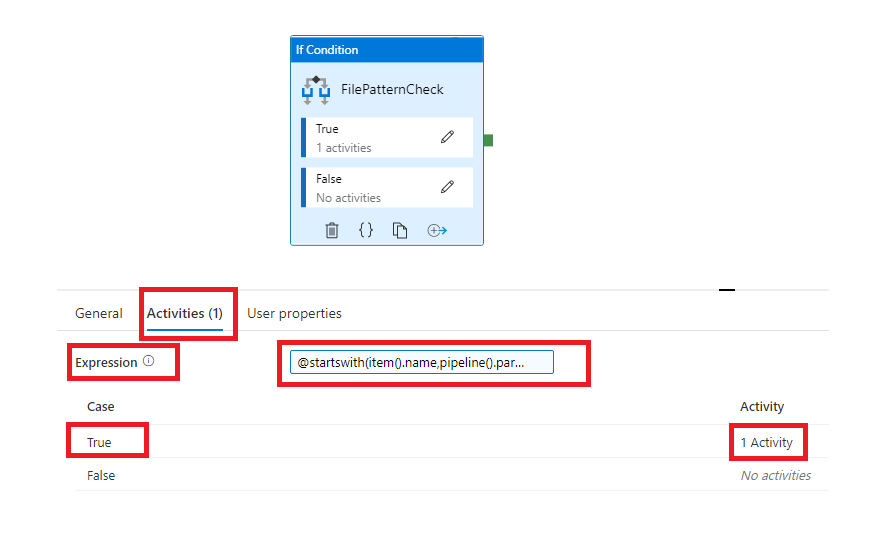
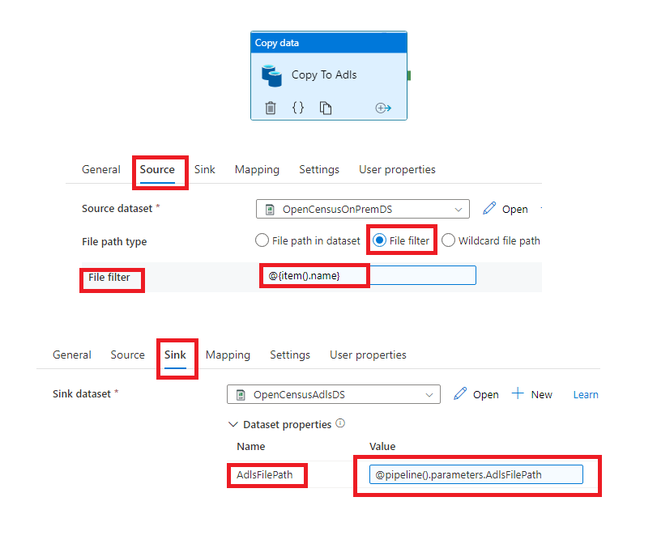
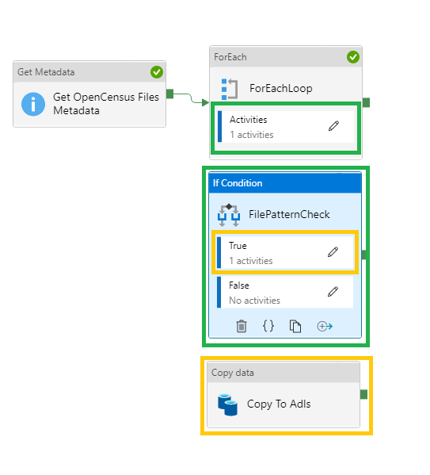
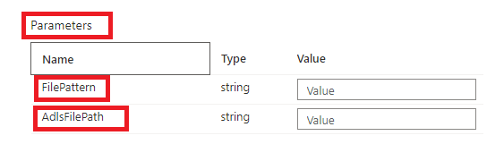

# Problem Statement:

1.  To transfer csv files from On premise machine that start with a specified prefix to Adls path of choice using Azure Data Factory(Adf)
    
2.  Consume the files within Adls input folder populated from Adf and archive them to a specified archive folder on to Adls
    

 # Design and Implementation:

In order to make sure that files with a specified prefix get ingested into Adls, the following steps are taken in Azure Data Factory:

1.  Create Linked Service for connecting to the on-premise virtual machine using Self Hosted Integration Runtime
    
2.  Create Linked Service for connecting to Adls 
    
3.  Create DataSet for csv files residing in a file system on the on-premise virtual machine
    
4.  Create DataSet for the destination csv files on Adls parameterized with *AdlsFilePath* for choosing a dynamic folder path given by the user at the run time of the pipeline
    
5.  Create a pipeline which does the following:
    

-   Uses a Metadata Activity to get all the child items present in the folder of the Dataset created for on-premise files in step 3
    

  

-   The child items of the on-premise folder i.e all the files are then fed into a For Each loop which basically an iterator based activity for iterating on each file(output of the previous metadata activity)
    

  

The items on which this For Loop will iterate are provided as an expression in Items tab of the *ForEach* Activity settings. The following expression is used:

`@activity('Get OpenCensus Files Metadata').output.childItems`

-   Inside this *ForEach* Activity is an conditionals activity *If Condition* which checks whether the file which is being iterated starts with the provided prefix or not
    

  

The expression in the *Activities* tab of the *If Condition* is responsible for filtering only those files with the specified prefix. The following expression is used:

`@startswith(item().name,pipeline().parameters.FilePattern)`

where `pipeline().parameters.FilePattern` is a pipeline parameter named *FilePattern* which contains the prefix which has to be provided by the user at the run of the pipeline

-   If the expression provided in the above *If Condition* Activity is True then a *Copy Activity* gets carried out which copies the file having the specified prefix from on-premise virtual machine to specified Adls path
    
 

  

In source of the *Copy Activity* the file name that should be copied is given by the following expression:

  
`@item.name()`

  
which is the filename of coming through the iterator of *ForEach* Activity which met the prefix condition in the *If Condition* Activity

  
In the sink of the *Copy Activity* the path on which the above file should be ingested is given as the following expression:

`@pipeline().parameters.AdlsFilePath`

where `pipeline().parameters.AdlsFilePath` is a pipeline parameter named *AdlsFilePath* which refers to the Adls file path on which the on-premise files matching the prefix should be ingested

This parameter has to be provided by the user at the run of the pipeline

  
Below is an overall architecture of the pipeline:

  

  
***Note*** : On trigger the above pipelines the user is asked to provide the two parameters : FilePattern( file prefix) and AdlsFilePath(the path on adls where the on premise files having the required prefix should be ingested) as shown below :

  

Now in order to consume and archive the files to a specific provided Adls folder, a script is written in databricks which does the following:

1.  Reads the files from the Adls folder (which was populated by the above Azure DataFactory Process),
    
2.  Transforms the data by selecting subset of columns and adding the insert timestamp to the records and finally writing the transformed data to delta table
    
3.  Archive the files consumed to a specific archive folder
    

The overall architecture diagram below explains the entire process:

  

  

